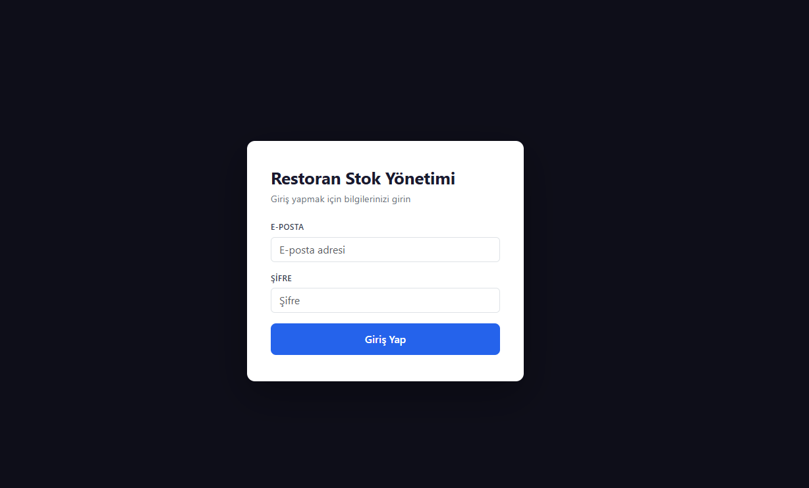
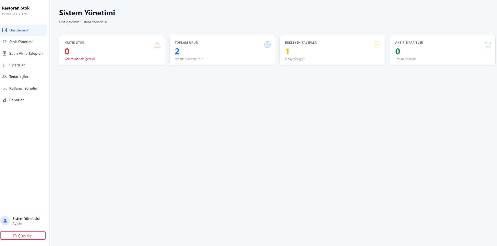
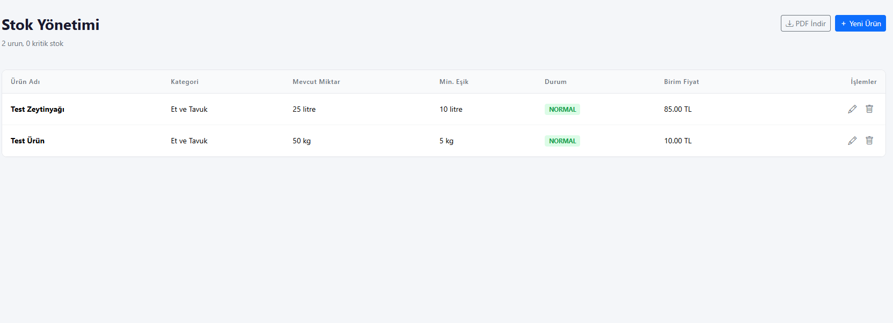
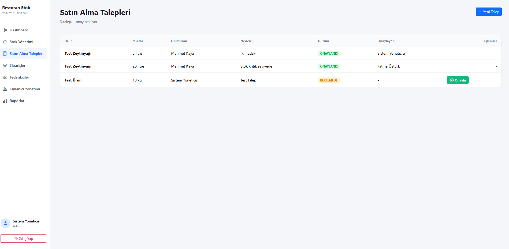
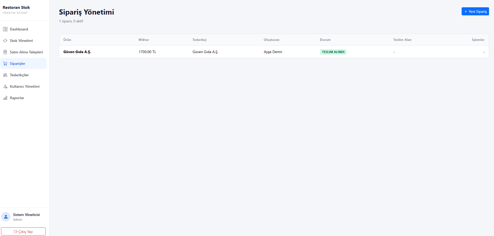
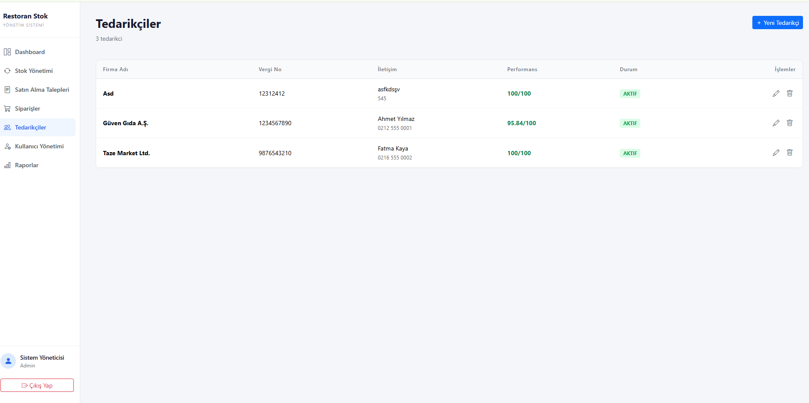
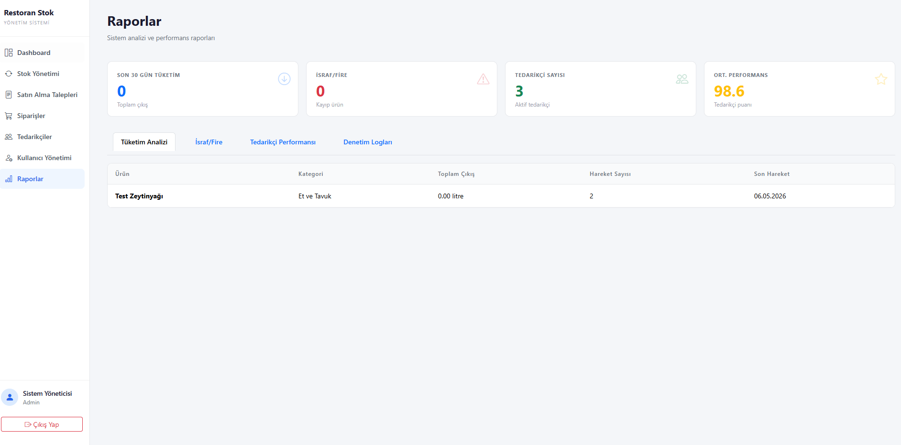

# 🍽️ Restoran Tedarik ve Stok Yönetim Sistemi

<div align="center">


Restoran işletmelerinde tedarik zinciri ve stok süreçlerini dijitalleştiren, rol tabanlı yetkilendirme ve akıllı karar destek mekanizmalarıyla güçlendirilmiş **web tabanlı yönetim sistemi**.

[Özellikler](#-özellikler) · [Kurulum](#-kurulum) · [Ekran Görüntüleri](#-ekran-görüntüleri) · [Katkıda Bulunanlar](#-katkıda-bulunanlar)

</div>

---

## 📋 Proje Hakkında

Bu proje, **Kocaeli Sağlık ve Teknoloji Üniversitesi 2025-2026 Bahar Dönemi Yazılım Lab II** dersi kapsamında geliştirilmiştir.

Sistem, sadece bir veri kayıt aracı değil; stok yaşam döngüsünü (SKT) denetleyen, tedarikçi verimliliğini ölçen ve geçmiş tüketim verilerine dayalı akıllı sipariş önerileri sunan kapsamlı bir çözümdür.

### Problemler & Çözümler

| Problem | Çözüm |
|---------|-------|
| Manuel stok takibindeki hatalar | Gerçek zamanlı dijital stok izleme ve otomatik kritik seviye uyarıları |
| Tedarikçi performansının ölçülememesi | Zamanında teslimat, fiyat ve kaliteye dayalı otomatik puanlama (0-100) |
| Son kullanma tarihi takipsizliği | SKT yaklaşan ürünler için otomatik "Kritik Risk" bildirimleri |
| Şeffaf olmayan satın alma süreçleri | Hiyerarşik onay mekanizması ve tam izlenebilirlik |

---

## ✨ Özellikler

- **Rol Bazlı Yetkilendirme (RBAC)** — Admin, Yönetici, Depo Sorumlusu ve Satın Alma Sorumlusu olmak üzere 4 farklı yetki seviyesi
- **Akıllı Stok & SKT Yönetimi** — Kritik stok eşik uyarıları, son kullanma tarihi takibi ve tüketim hızı analizi
- **Satın Alma Talep & Onay Sistemi** — Depo sorumlusunun talep oluşturması → Yönetici onayı → Satın alma sorumlusunun siparişe dönüştürmesi
- **Tedarikçi Performans Değerlendirmesi** — Her teslimat sonrası otomatik performans puanlaması
- **Parçalı Teslimat Yönetimi** — Eksik gelen ürünlerin "Bekleyen Sipariş" olarak takibi
- **Fire/İsraf Takibi** — Tüketim, bozulma, dökülme/kırılma ve iade kategorilerinde sınıflandırma
- **Finansal Yönetim** — Otomatik ödeme kaydı oluşturma ve vadesi yaklaşan ödemeler için uyarı
- **Raporlama** — Tüketim analizi, israf/fire, tedarikçi performansı ve denetim logları raporları
- **Denetim Kayıtları (Audit Logs)** — Tüm kritik işlemlerin tarih, kullanıcı ve IP bilgisiyle loglanması
- **Güvenlik** — BCrypt ile şifre hashleme, JWT token tabanlı kimlik doğrulama, hesap kilitleme

---

## 🏗️ Sistem Mimarisi

```
┌─────────────────────────────────────────────────────┐
│                    FRONTEND                         │
│            HTML / CSS / JavaScript                  │
│              (Responsive Tasarım)                   │
└──────────────────────┬──────────────────────────────┘
                       │ REST API
┌──────────────────────▼──────────────────────────────┐
│                    BACKEND                          │
│              Node.js / Express.js                   │
│         JWT Auth · RBAC · Business Logic            │
└──────────────────────┬──────────────────────────────┘
                       │
┌──────────────────────▼──────────────────────────────┐
│                   DATABASE                          │
│                    MySQL                            │
│     12 Tablo · FK İlişkileri · ACID Uyumlu          │
└─────────────────────────────────────────────────────┘
```

---

## 👥 Kullanıcı Rolleri

| Rol | Yetkiler |
|-----|----------|
| **Admin** | Tam sistem erişimi, kullanıcı yönetimi, rol atama, güvenlik logları, sistem ayarları |
| **Yönetici** | Satın alma taleplerini onaylama/reddetme, performans raporları, stok devir hızı analizi |
| **Depo Sorumlusu** | Stok takibi, ürün giriş-çıkış, SKT yönetimi, satın alma talebi oluşturma, teslimat kabul |
| **Satın Alma Sorumlusu** | Onaylı talepleri siparişe dönüştürme, tedarikçi yönetimi, fiyat kıyaslama |

### Demo Giriş Bilgileri

| Rol | E-posta | Şifre |
|-----|---------|-------|
| Sistem Yöneticisi (Admin) | admin@restoran.com | Admin@123 |
| Depo Sorumlusu | depo@restoran.com | Depo@123 |
| Satın Alma Sorumlusu | satin@restoran.com | Satin@123 |
| Yönetici | yonetici@restoran.com | Yonetici@123 |

---

## 🚀 Kurulum

### Gereksinimler

- [Node.js](https://nodejs.org/) (v16+)
- [MySQL](https://www.mysql.com/) (v8+)
- [Git](https://git-scm.com/)

### Adımlar

**1. Repoyu klonlayın**

```bash
git clone https://github.com/emirsariii/tedarik-sistemi.git
cd tedarik-sistemi
```

**2. Veritabanını kurun**

`database/` klasöründeki SQL dosyasını MySQL sunucunuza aktarın:

```bash
mysql -u root -p < database/schema.sql
```

**3. Backend bağımlılıklarını yükleyin**

```bash
cd backend
npm install
```

**4. Ortam değişkenlerini yapılandırın**

`backend/` dizininde bir `.env` dosyası oluşturun ve veritabanı bağlantı bilgilerinizi girin:

```env
DB_HOST=localhost
DB_USER=root
DB_PASSWORD=your_password
DB_NAME=tedarik_sistemi
JWT_SECRET=your_secret_key
PORT=3000
```

**5. Sunucuyu başlatın**

```bash
npm start
```

**6. Tarayıcıda açın**

```
http://localhost:3000
```

---

## 📸 Ekran Görüntüleri

### Giriş Sayfası


### Dashboard (Sistem Yönetimi)


### Stok Yönetimi


### Satın Alma Talepleri


### Sipariş Yönetimi


### Tedarikçiler


### Raporlar


---

## 📂 Klasör Yapısı

```
tedarik-sistemi/
├── backend/                 # Sunucu tarafı (Node.js / Express.js)
│   ├── routes/              # API endpoint tanımları
│   ├── controllers/         # İş mantığı katmanı
│   ├── models/              # Veritabanı modelleri
│   └── middleware/          # Auth, RBAC ve diğer ara katmanlar
├── frontend/                # Kullanıcı arayüzü (HTML, CSS, JS)
│   ├── pages/               # Sayfa dosyaları
│   ├── css/                 # Stil dosyaları
│   └── js/                  # İstemci tarafı scriptler
├── database/                # SQL şema ve seed dosyaları
├── kullanici_bilgileri/     # Test kullanıcı bilgileri
├── proje_gorselleri/        # Uygulama ekran görüntüleri
├── TedarikSistemi_Raporu.pdf  # Proje raporu
└── README.md
```

---

## 🗄️ Veritabanı Şeması

Sistem **12 ana tablo** üzerine kurgulanmıştır:

| Tablo | Açıklama |
|-------|----------|
| `Users` | Kullanıcı hesapları ve kimlik bilgileri |
| `Roles` | Yetki seviyesi grupları (Admin, Yönetici, Depo, Satın Alma) |
| `AuditLogs` | Denetim kayıtları (kim, ne zaman, ne yaptı) |
| `Categories` | Ürün kategorileri (Et, Sebze, İçecek vb.) |
| `Products` | Ürün tanım kartları |
| `Inventory` | Anlık stok miktarları ve SKT bilgileri |
| `StockMovements` | Stok giriş/çıkış/fire hareket geçmişi |
| `Suppliers` | Tedarikçi firma bilgileri ve performans puanları |
| `PurchaseRequests` | Satın alma talepleri |
| `Orders` | Tedarikçiye verilen siparişler |
| `OrderDetails` | Sipariş kalem detayları |
| `Payments` | Ödeme takibi |
| `Notifications` | Sistem bildirimleri |

---

## 🤝 Katkıda Bulunanlar

| İsim | GitHub |
|------|--------|
| Muhammed Emir Sarı | [@emirsariii](https://github.com/emirsariii) |
| Sıla Serdar | [@SilaSerdar](https://github.com/SilaSerdar) |
| Hasan Çavdar | [@hasan-cavdar](https://github.com/hasan-cavdar) |
| Abdülrahim Usta | [@abdulUsta1](https://github.com/abdulUsta1) |
| Recep Akşar | [@aksar43](https://github.com/aksar43) |

---

## 📄 Lisans

Bu proje **Kocaeli Sağlık ve Teknoloji Üniversitesi** Yazılım Lab II dersi kapsamında eğitim amaçlı geliştirilmiştir.

---

<div align="center">

⭐ Projeyi beğendiyseniz yıldız vermeyi unutmayın!

</div>
